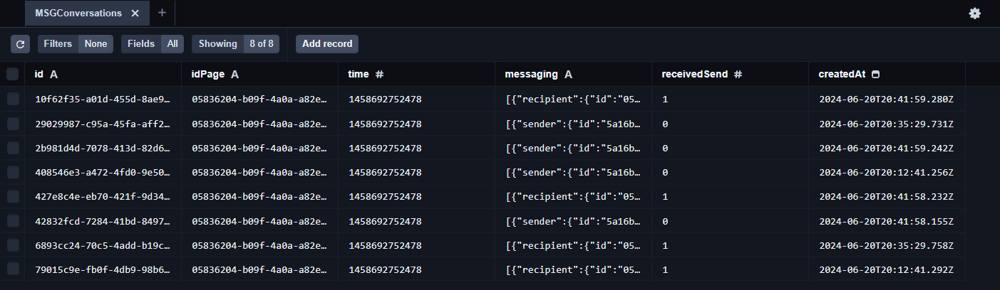

# Iniciar o projeto

### OBS.
#### A aplicação está configurada para usar a porta 3000, caso seja necessário alterar, mude porta no arquivo .env.development antes de iniciar o projeto.
#### O projeto não entende o arquivo ".env.development", sendo necessário alterar o nome dele para ".env" pois é nele que estão as configurações necessárias para comunicação com o banco de dados e a porta da aplicação, lembre de criar a connectionString do MongoDB e adicionar nesse arquivo no atributo: DATABASE_URL.

### Iniciando com o docker
#### Navegue até a pasta onde o projeto foi clonado, abra o terminal e execute os seguintes comandos:

```
docker build -t 4Linck/poc-smarters .

docker run -p 3000:3000 4Linck/poc-smarters
```

### Iniciando sem docker
#### Para iniciar o projeto manualmente, será necessário a instalação do node na versão 20.14.x e o npm versão 10.7.x, você pode ter problemas de execução caso esteja com uma versão mais Antiga/Nova, para verificar as suas versões, abra o terminal e execute os seguintes comandos: 

```
node --version

npm --version
```

#### Para iniciar, navegue até a pasta onde o projeto foi clonado, abra o terminal e execute os seguinte comando:
```
npm run dev
```

Nesse modo também é possível executar o Prisma Studio, que pode ser bem útil para acompanhar as mensagens inseridas do banco de dados!

#### Para subir o schema do Prisma, navegue até a pasta onde o projeto foi clonado, abra o terminal e execute os seguinte comando:
```
npx prisma db push
```

#### Para iniciar o Prisma Studio, navegue até a pasta onde o projeto foi clonado, abra o terminal e execute os seguinte comando:
```
npx prisma studio
```

Caso venha a ter problemas para executar o Prisma Studio, verifique as **devDependencies**, no arquivo package.json!

**Exemplo: Prisma Studio**

9
## Endpoints e parâmetros de requisição
### A aplicação possui apenas um endpoint "/api/message" que responde requisições do tipo GET e POST, GET para consultar a lista de mensagens enviadas e recebidas, e POST para enviar mensagens.

### Assim que você iniciar o projeto, ele responderá em http://localhost:3000 | http://127.0.0.1:3000

**Endpoint**: http://localhost:3000/api/message, **TIPO**: GET, **PARAMETROS**: NÃO

Exemplo de retorno, **Array** com as mensagens enviadas e recebidas e persistidas no banco dedos:

```
[
    {
        "id": "408546e3-a472-4fd0-9e50-cd5079cd674a",
        "idPage": "05836204-b09f-4a0a-a82e-bc9b3c6cbb74",
        "time": 1458692752478,
        "messaging": [
            {
                "sender": {
                    "id": "5a16b3de-f9f3-491d-b1e4-8ccea65372fd"
                },
                "recipient": {
                    "id": "05836204-b09f-4a0a-a82e-bc9b3c6cbb74"
                },
                "timestamp": 1762902671,
                "message": {
                    "mid": "mid.1457764197618:41d102a3e1ae206a38",
                    "text": "Olá"
                }
            }
        ],
        "receivedSend": 0,
        "createdAt": "2024-06-20T20:12:41.256Z"
    },
    {
        "id": "79015c9e-fb0f-4db9-98b6-e07af91e1541",
        "idPage": "05836204-b09f-4a0a-a82e-bc9b3c6cbb74",
        "time": 1458692752478,
        "messaging": [
            {
                "recipient": {
                    "id": "05836204-b09f-4a0a-a82e-bc9b3c6cbb74"
                },
                "message": {
                    "attachment": {
                        "type": "template",
                        "payload": {
                            "template_type": "button",
                            "text": "Olá! O que você gostaria de fazer a seguir?",
                            "buttons": [
                                {
                                    "type": "postback",
                                    "title": "Começar",
                                    "payload": "GO_START"
                                },
                                {
                                    "type": "postback",
                                    "title": "Suporte",
                                    "payload": "GO_SUPPORT"
                                },
                                {
                                    "type": "postback",
                                    "title": "Ajuda",
                                    "payload": "GO_HELP"
                                }
                            ]
                        }
                    }
                }
            }
        ],
        "receivedSend": 1,
        "createdAt": "2024-06-20T20:12:41.292Z"
    }
]
```

**Endpoint**: http://localhost:3000/api/message, **TIPO**: POST, **PARAMETROS**: SIM, BODY/JSON

Exemplo de entrada, **Objeto** : podendo ser do tipo **message** ou **postback**:

**message**:
```
{
    "id": "05836204-b09f-4a0a-a82e-bc9b3c6cbb74",
    "time": 1458692752478,
    "messaging": [
        {
            "sender": {
                "id": "5a16b3de-f9f3-491d-b1e4-8ccea65372fd"
            },
            "recipient": {
                "id": "05836204-b09f-4a0a-a82e-bc9b3c6cbb74"
            },
            "timestamp": 1762902671,
            "message": {
                "mid": "mid.1457764197618:41d102a3e1ae206a38",
                "text": "ping"
            }
        }
    ]
}
```

**postback**:
```
{
    "id": "05836204-b09f-4a0a-a82e-bc9b3c6cbb74",
    "time": 1458692752478,
    "messaging": [
        {
            "sender": {
                "id": "5a16b3de-f9f3-491d-b1e4-8ccea65372fd"
            },
            "recipient": {
                "id": "05836204-b09f-4a0a-a82e-bc9b3c6cbb74"
            },
            "timestamp": 1762902671,
            "postback": {
                "mid": "mid.1457764197618:41d102a3e1ae206a38",
                "payload": "GO_HELP"
            }
        }
    ]
}
```

Exemplo de retorno, **Objeto** com a mensagem enviada no callback, podendo ser do tipo **message** ou **template**:

**message**:
```
{
    "recipient": {
        "id": "05836204-b09f-4a0a-a82e-bc9b3c6cbb74"
    },
    "message": {
        "text": "OK!, vou verificar se existe um atendente disponível!"
    }
}
```

**template**:
```
{
    "recipient": {
        "id": "05836204-b09f-4a0a-a82e-bc9b3c6cbb74"
    },
    "message": {
        "attachment": {
            "type": "template",
            "payload": {
                "template_type": "button",
                "text": "Olá! O que você gostaria de fazer a seguir?",
                "buttons": [
                    {
                        "type": "postback",
                        "title": "Começar",
                        "payload": "GO_START"
                    },
                    {
                        "type": "postback",
                        "title": "Suporte",
                        "payload": "GO_SUPPORT"
                    },
                    {
                        "type": "postback",
                        "title": "Ajuda",
                        "payload": "GO_HELP"
                    }
                ]
            }
        }
    }
}
```